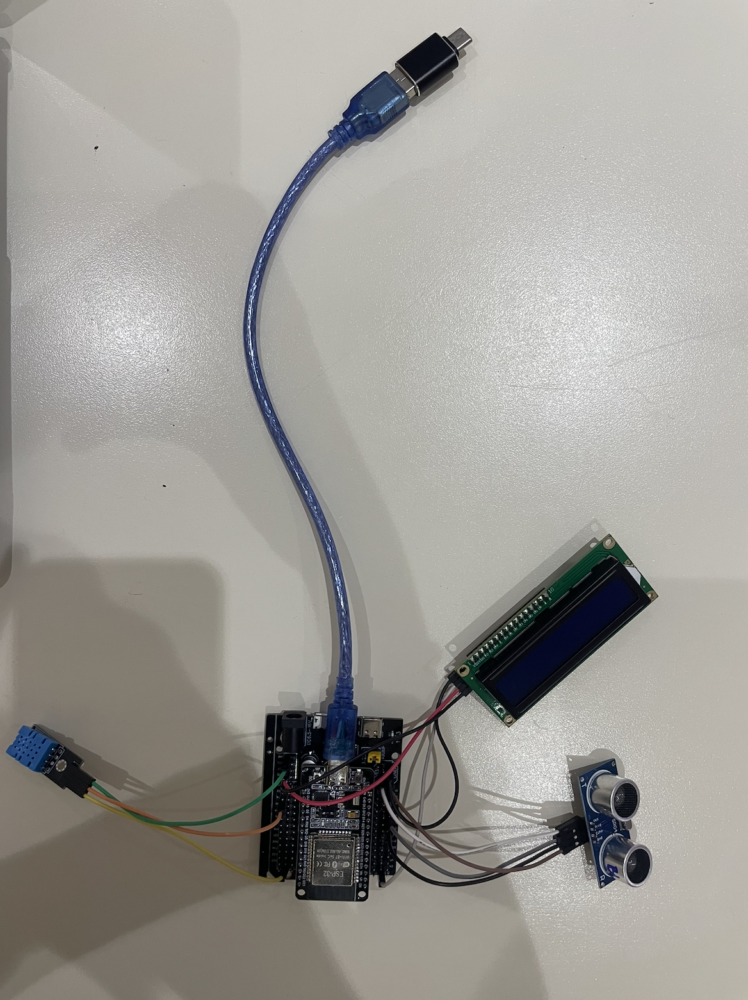

# IOT_Group 6
## Team Members: 
- PONLORK Ponita
- LY Soryapheak
- SEAN Sophal Theany
# Lab 1
## 1. Overview
In this lab, you will build a tiny IoT monitoring node with an ESP32, DHT22
temperature/humidity sensor, and a relay. The ESP32 sends Telegram alerts when the
temperature rises above a threshold and lets users control the relay via chat commands. Once the
temperature drops below the threshold again, the relay turns off automatically.

## 2. Learning Outcomes (CLO Alignment)
• Design & implement an IoT system using ESP32 + MicroPython (sensing, actuation,
networking).
• Apply programming techniques for periodic sampling, debouncing, and simple state
machines.
• Develop a chat-based remote control application using Telegram Bot API (HTTP
requests).
• Document & present system design, wiring, and test evidence (screenshots/video), and
reflect on reliability/ethics.
• Evaluate performance (sampling interval, rate limits) and safety (relay loads, power
isolation).

## 3. Equipment
• ESP32 Dev Board (MicroPython firmware flashed)
• DHT22 sensor
• Relay module
• jumper wires
• USB cable + laptop with Thonny
• Wi-Fi access (internet)

## 4. Configuration Steps 
### 4.1 WIFI Settings 
WIFI_SSID = "Robotic WIFI"
WIFI_PASSWORD = "rbtWIFI@2025"

### 4.2 Telegram Bot Token
1. Open Telegram and search for @BotFather
2. Create a new bot using /newbot
3. Copy the Bot Token
4. Paste it into the code:
    BOT_TOKEN = "8231699710:AAF01UR3dkMPL7d0NuW7ou9Z2jonBTkeCeM"

### 4.3 Telegram chat ID
1. Add the bot to your Telegram group
2. Send any message in the group (/start, /getid)
3. Copy the chat.id
     CHAT_ID = "-5095049406"

### 4.4 Creat an telegram group 
(to control and send command as a team) 
Add the created Bot and IDBot to the group

## 4. Wiring

## Flowchart of loop/state
Figma Link: https://www.figma.com/board/S3RnOzh0yR1G12ljfvSsmF/Untitled?node-id=0-1&t=jhkFKWTbEELplBLc-1

The system flowchart shows the logical flow of the ESP32 program. After initialization, the ESP32 continuously checks Wi-Fi connectivity, reads temperature and humidity from the DHT sensor, processes Telegram bot commands, and controls the relay based on temperature conditions. Robustness mechanisms ensure the system continues operating during Wi-Fi disconnections, Telegram HTTP errors, and sensor read failures.

## Short demo video
Link: https://youtu.be/jLcnGuaP9m8

# Lab 2
IoT Webserver with LED, Sensors, and LCD Control
## 1. Overview
In this lab, students will design an ESP32-based IoT system with MicroPython that integrates a
web interface and an LCD display. The system will allow users to control an LED, read sensors,
and send custom messages to the LCD through a webserver.
This lab emphasizes interaction between web UI and hardware, giving students practice in event-
driven IoT design.
## 2. Learning Outcomes (CLO Alignment)
By the end of this lab, students will be able to:
• Implement a MicroPython webserver to serve HTML controls.
• Control an LED from the web page.
• Read data from DHT11 and ultrasonic sensors and expose it on the webserver.
• Use web buttons to selectively show temperature and distance on an LCD (I²C).
• Send custom text from a textbox to display on the LCD.
• Document wiring, interface behavior, and system operation.
## 3. Equipment
• ESP32 Dev Board (MicroPython firmware flashed)
• DHT11 sensor (temperature/humidity)
• HC-SR04 ultrasonic distance sensor
• LCD 16×2 with I²C backpack
• Breadboard, jumper wires
• USB cable + laptop with Thonny
• Wi-Fi access

## 4. Wiring

## Short demo video
Link: https://youtu.be/yYCM0TSFDB8?si=hEB5IBhJ2DM1MjQh

# LAB 3
IoT Smart Gate Control with Blynk, IR Sensor, Servo Motor,
and TM1637
## 1. Overview
In this lab, students will design and implement an ESP32-based IoT system using MicroPython
and the Blynk platform. The system integrates an IR sensor for object detection, a servo motor for
physical actuation, and a TM1637 7-segment display for real-time local feedback. Students will
use the Blynk mobile application to remotely control the system, monitor sensor status, and
observe system behavior.
This lab emphasizes interaction between sensors, actuators, cloud-based control, and local
display, reinforcing event-driven and IoT system design concepts.
## 2. Learning Outcomes (CLO Alignment)
• Integrate multiple sensors and actuators into a single IoT system using ESP32.
• Use Blynk to remotely control hardware and visualize system status.
• Implement automatic and manual control logic based on sensor input and cloud commands.
• Display system status and numerical data using a TM1637 7-segment display.
• Document system wiring, logic flow, and IoT behavior clearly.
## 3. Equipment
## 4. System Description
The IR sensor detects the presence of an object in front of the system. When an object is detected,
the ESP32 processes the signal and automatically rotates the servo motor to simulate opening a
gate or barrier. Each detection event increments a counter, which is displayed locally on the
TM1637 display and sent to the Blynk app for remote monitoring.
Users can also manually control the servo motor through the Blynk app, overriding the automatic
mode if required.
## 5. Tasks & Checkpoints
All submitted work must be original. Plagiarism or code sharing is strictly prohibited.
### Task 1 – IR Sensor Reading
• Read IR sensor digital output using ESP32.
• Display IR status (Detected / Not Detected) on Blynk.
• Evidence: Screenshot of Blynk showing IR status.
### Task 2 – Servo Motor Control via Blynk
• Add a Blynk Slider widget to control servo position.
• Slider position from 0 to 180 degree and the servo is moving following the slider
• Evidence: Short video showing phone control servo movement.
### Task 3 – Automatic IR - Servo Action
• When IR sensor detects an object, servo opens automatically.
• After a short delay, servo returns to closed position.
• Evidence: Video showing automatic response to object detection.
### Task 4 – TM1637 Display Integration
• Count the number of IR detection events.
• Display the counter value on the TM1637 display.
• Send the same value to Blynk numeric display widget.
• Evidence: Video showing TM1637 display and Blynk value match.
### Task 5 – Manual Override Mode
• Add a Blynk switch to enable/disable automatic IR mode.
• When manual mode is active, IR sensor is ignored.
• Evidence: Demonstration video of override behavior.

